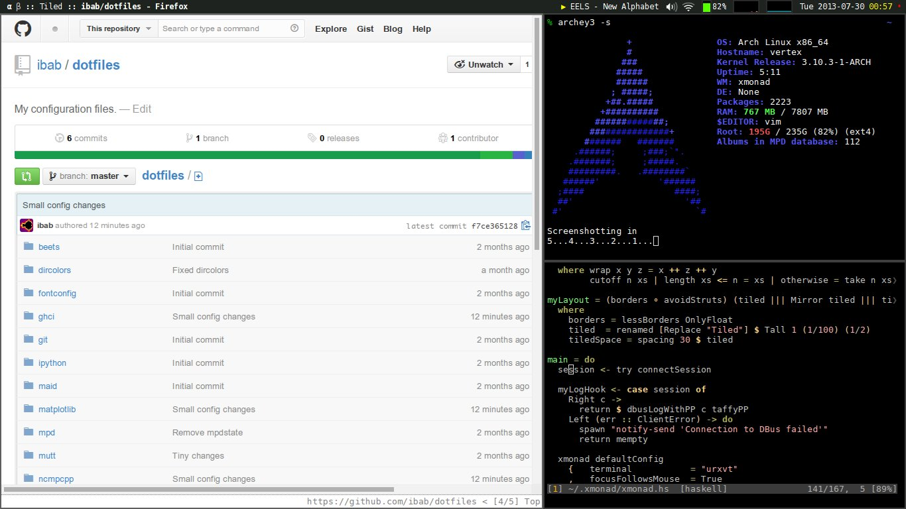

# My configuration files

This repository contains my unix configuration files.
Each directory groups together config files for a single application or purpose. 
The config files in each directory belong into `$HOME`.

I use [GNU stow](https://www.gnu.org/software/stow/) to link them into my home directory.
For example, to set up vim on a new machine, I execute

```bash
git clone git@github.com:ibab/dotfiles ~/.dotfiles
cd ~/.dotfiles
stow vim
```

I also manage sensitive files like my email config and SSH keys through this repo, but they are stored on a separate server and accessed with [`git-annex`](https://git-annex.branchable.com/).
To set these up, I run
```bash
git annex enableremote $SECUREREMOTE
git annex get
```
on the server, where `SECUREREMOTE` is the name of the git-annex remote that stores my sensitive files.

## Notes

This is where I document suggestions and tricks that might be useful for others.

### terminfo

If you're using terminals like `rxvt-unicode` or `st` that have their own `$TERM` variable, you've probably noticed that many servers don't know about these by default and will refuse to open certain programs like `htop`, unless you set the `TERM` variable to something they know about (like `xterm-256color`).
This can be fixed by installing the corresponding terminal on the server.
But you might not want to install all the graphical dependencies of your terminal, or you might not have `sudo` access.
In this case, it's convenient to place working `terminfo` database entries into your dotfiles, which allow a server to automatically recognize your `TERM` variable.
This is the purpose of the [`terminfo`](terminfo/) directory in this repo.
To set up something like this yourself, you can copy terminfo definitions from `/usr/share/terminfo/`.

## Screenshot



